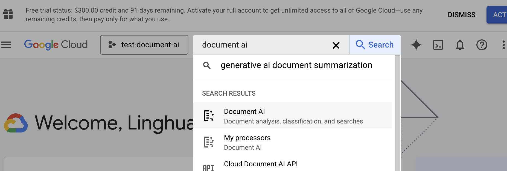

# 🥥 CocoIndex ETL with Document AI 

[CocoIndex](https://cocoindex.io) is an ETL framework to transform data for AI, with real-time incremental processing - keep index up to date with low latency on source update. It supports custom logic like LEGO, and makes it easy for users to plugin the modules that best suits their project.

In this example, we will walk you through how to build embedding index based on local files, using [Google Document AI](https://cloud.google.com/document-ai?hl=en) as parser.

🥥 🌴 We are constantly improving - more blogs and examples coming soon. Stay tuned 👀 and **drop a star at [Cocoindex on Github](https://github.com/cocoindex-io/cocoindex)** for latest updates!
[](https://github.com/cocoindex-io/cocoindex)


## Prerequisite
- [Install Postgres](https://cocoindex.io/docs/getting_started/installation#-install-postgres) if you don't have one.
- Configure Project and Processs ID for Document AI API
    - [Official Google document AI API](https://cloud.google.com/document-ai/docs/try-docai)
    - Sign in to [Google Cloud Console](https://console.cloud.google.com/), create or open a project, and enable Document AI API. 
      
    - Create a processor in Document AI.
      
- update '.env' with `GOOGLE_CLOUD_PROJECT_ID` and `GOOGLE_CLOUD_PROCESSOR_ID`.


## Run

Install dependencies:

```bash
pip install -e .
```

Setup:

```bash
python main.py cocoindex setup
```

Update index:

```bash
python main.py cocoindex update
```

Run:

```bash
python main.py
```

## CocoInsight 
CocoInsight is in Early Access now (Free) 😊 You found us! A quick 3 minute video tutorial about CocoInsight: [Watch on YouTube](https://youtu.be/ZnmyoHslBSc?si=pPLXWALztkA710r9).

Run CocoInsight to understand your RAG data pipeline:

```
python main.py cocoindex server -c https://cocoindex.io
```

Then open the CocoInsight UI at [https://cocoindex.io/cocoinsight](https://cocoindex.io/cocoinsight).
